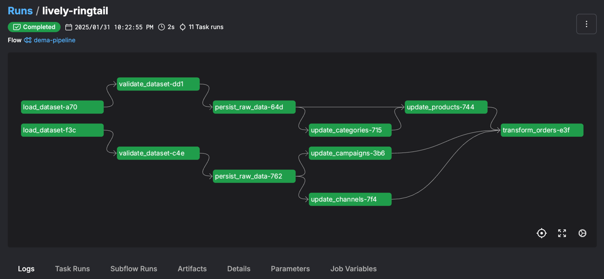

# Data Ingestion Pipeline for Dema

A Prefect pipeline that ingests data from two CSV sources, persists the raw data to a database, 
and then transforms the data into a normalized form.

## Overview

This pipeline created using tools:
- [Prefect](https://www.prefect.io) for workflow management
- [Pandas](https://pandas.pydata.org) for data manipulation
- [SQLAlchemy](https://www.sqlalchemy.org) for database interaction
- [Pydantic](https://pydantic.dev) for data validation
- **Postgres** as a database

## Installation

```bash
make init
```

## Usage

To run the pipeline:

```bash
make local_run
```
It will run database in Docker and Prefect flow in the local environment.

Access the Prefect UI at http://localhost:4200/runs



## Development

Copy `.env.example` to `.env` and fill in the required environment variables.

Update `DATABASE_DSN` in the `.env` file with your database connection string.

## Example Analytics Queries

Example queries can be found in the `analytics.sql` file.

## Next Steps and TODOs

- Run Prefect server and flows in Docker container
- Add unittests for the pipeline tasks
- Add integration tests for the pipeline
- Optimize the pipeline for large datasets 
__(current implementation works for relatively small datasets, work with raw data should be done in chunks)__
- Depending on the data source, consider using an incremental load strategy
- If needed, historical data can be stored in and calculated in `staging` schema
- To efficiently handle large datasets, consider using columnar storage like Parquet or Redshift.
- Add `analytics` schema to create customized views and tables for analytics purposes: 
    - Create a materialized view for the most frequently used queries
- Assuming pipeline will be run on a regular basis, add `cron` scheduler to the flow and download data for the last period from the source